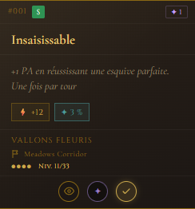
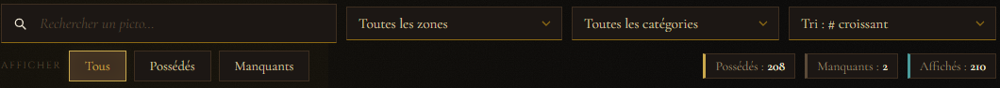
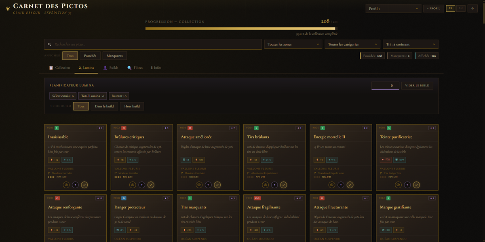
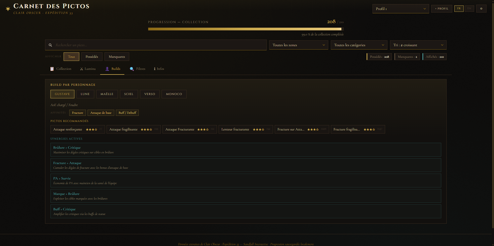
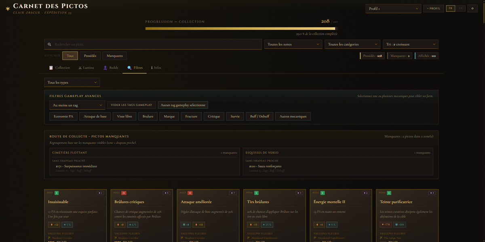
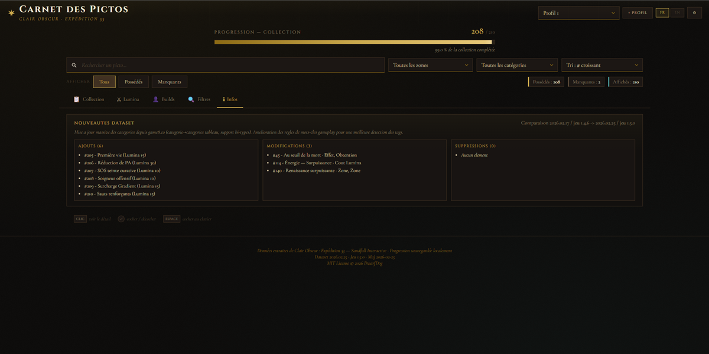

# Clair Obscur: Expedition 33 — Picto Tracker

> **[Français](#-version-française)** | **[English](#-english-version)**

---

## 📌 25/02/2026 : 210 Pictos

---

##  Version Française

### Qu'est-ce que c'est ?

Un **carnet de collection complet** pour suivre, planifier et optimiser vos Pictos dans *Clair Obscur : Expedition 33*.

Marquez les Pictos que vous possédez, suivez leur maîtrise et leur niveau, planifiez vos builds Lumina, consultez les affinités par personnage et tracez votre route de collecte — le tout **sans compte, sans installation, directement dans votre navigateur**.

Vos données restent sur votre appareil (sauvegarde locale). L'application fonctionne aussi hors-ligne grâce au mode PWA.


---

### Fonctionnalités

#### Collection & Suivi

- **210 Pictos** référencés avec données complètes (effet, stats, zone, obtention, coût Lumina)
- Suivi de **possession** avec barre de progression visuelle et pourcentage
- **Maîtrise** par Picto (0 à 4 niveaux) — visible sur les cartes et modifiable dans la fiche détail
- **Niveau** par Picto (1 à 33) — visible sur les cartes et modifiable dans la fiche détail
- Indicateurs de suivi directement sur les cartes : discrets si non possédé, mis en évidence si possédé
- Compteurs en temps réel : possédés, manquants, affichés



#### Fiche détail (modal)

- Barre meta : numéro d'ID, badge catégorie coloré, coût Lumina
- Nom du Picto dans la langue active (nom secondaire affiché uniquement en cas de traduction dérivée)
- **Effet** détaillé et **statistiques** (PV, Défense, Vitesse, Critique)
- **Localisation** : zone + point de téléportation (drapeau)
- **Classification** : catégorie (offensive / défensive / support) avec badges colorés, type d'obtention
- **Affinités personnages** avec score étoilé (★★★☆)
- Contrôles interactifs : maîtrise (cercles cliquables), niveau (+/−), possession
- Source endgame et information boss quand applicable


#### Recherche, Filtres & Tri

- **Recherche instantanée** par nom ou effet (avec debounce, insensible aux accents)
- **Filtre par zone** (dropdown dynamique)
- **Filtre par catégorie** : offensive, défensive, support
- **Filtre par type d'obtention** : exploration, marchand, boss, paint cage, quête, histoire
- **Filtre collection** : tous / possédés / manquants
- **Filtre build** : tous / dans le plan / hors plan
- **Filtres gameplay avancés** : tags mécaniques (survie, brûlure, critique, marque…) avec mode "au moins un" ou "tous"
- **13 options de tri** : par n°, nom, zone, possession, coût Lumina, catégorie (chacun asc/desc), build en premier



#### Planificateur Lumina

- Définissez un **budget Lumina** et sélectionnez les Pictos à intégrer dans votre build
- Compteurs en temps réel : Pictos sélectionnés, coût total, budget restant
- Indicateur visuel de **dépassement de budget**
- Les cartes dans le build sont visuellement marquées dans la grille
- Bouton de réinitialisation du build



#### Builds par personnage

- Sélecteur de personnage avec les héros du jeu
- **Affinités** : tags gameplay préférés de chaque personnage
- **Recommandations** : top 6 Pictos suggérés par score d'affinité (tags + catégorie)
- **Synergies** : combinaisons actives détectées parmi vos Pictos possédés



#### Route de collecte (Farm route)

- Liste des Pictos **manquants** regroupés par zone et point de téléportation
- Ordre optimisé pour le farming : zone → drapeau → Pictos
- Affichage du coût Lumina et des tags gameplay par Picto
- Se met à jour en fonction des filtres actifs



#### Système de profils

- Jusqu'à **12 profils** de progression indépendants
- Chaque profil sauvegarde : collection, build Lumina, budget, maîtrise, niveaux, cycle NG
- Nommage personnalisé des profils
- Changement rapide via le sélecteur dans l'en-tête

#### Cycles New Game+

- 4 cycles disponibles : **NG** (max 15), **NG+** (max 22), **NG++** (max 28), **NG+++** (max 33)
- Le niveau maximum des Pictos s'adapte au cycle sélectionné
- Paramètre sauvegardé par profil

#### Export / Import

- **Export presse-papier** : code Base64 pour partage rapide
- **Export fichier JSON** : par profil, avec métadonnées complètes
- **Export tous les profils** : un seul fichier contenant l'ensemble des profils
- **Import** : depuis code collé ou fichier `.json` / `.txt` (max 1 Mo)
- Compatible avec tous les formats historiques (migration automatique v1 → v6)

#### Nouveautés dataset (onglet Infos)

- Historique des ajouts, modifications et suppressions entre versions
- Notes de version localisées
- Détail des champs modifiés par Picto



#### Interface & Accessibilité

- **Bilingue** français / anglais (détection automatique, changement manuel)
- **PWA** : installable sur mobile et desktop, fonctionne hors-ligne
- **Scrollbars personnalisées** : fines (6px), dorées, discrètes
- **Accessibilité** : ARIA complet, navigation clavier, gestion du focus dans les modales
- **Impression** : mise en page optimisée pour l'impression (actions masquées)
- Notifications toast pour les actions (export, import, erreurs)

---

### Navigation par onglets

L'application s'organise en **5 onglets** :

| Onglet | Contenu |
|--------|---------|
| 📋 **Collection** | Grille des cartes avec filtres et recherche |
| ⚔ **Lumina** | Planificateur de build avec budget |
| 👤 **Builds** | Recommandations et synergies par personnage |
| 🔍 **Filtres** | Filtres gameplay avancés + route de collecte |
| ℹ **Infos** | Nouveautés du dataset + légende des contrôles |

---

### Comment l'utiliser

#### 1. Télécharger

Cliquez sur le bouton vert **Code** en haut de cette page, puis **Download ZIP**.


#### 2. Extraire

Décompressez le fichier ZIP dans un dossier de votre choix.

#### 3. Ouvrir

Double-cliquez sur le fichier **`CO33-Pictos.html`** — il s'ouvre dans votre navigateur.

> Aucune installation nécessaire. Fonctionne avec Chrome, Firefox, Edge, Safari.

> **Astuce PWA** : si vous hébergez l'application sur un serveur (même local), vous pouvez l'installer comme une application native via le bouton d'installation de votre navigateur.

---

### Contrôles

| Action | Résultat |
|--------|----------|
| **Clic sur l'œil** 👁 | Ouvre la fiche détail |
| **Clic sur le rond** ✓ | Coche / décoche la possession |
| **Clic droit sur une carte** | Ouvre la fiche détail |
| **Espace** (carte focus) | Coche / décoche la possession |
| **Entrée** (carte focus) | Ouvre la fiche détail |
| **Échap** | Ferme la modal / panneau ouvert |
| **Tab** | Navigation au clavier dans les modales |

---

### Paramètres (⚙)

Le menu paramètres en haut à droite donne accès à :

- **Cycle NG** : sélection du cycle New Game+ actif
- **Exporter** : exporte le profil actif
- **Importer** : importe une sauvegarde
- **Exporter tout** : télécharge tous les profils en un fichier
- **Réinitialiser** : remet à zéro la collection du profil actif

---

### Changer la langue

L'application détecte automatiquement la langue de votre navigateur. Vous pouvez aussi changer manuellement avec les boutons **FR** / **EN** en haut à droite.

---

### Ajouter une nouvelle langue

Vous voulez traduire l'application dans votre langue ? Voici comment :

1. **Copiez** le fichier `lang/en.js` et renommez-le (ex : `lang/es.js` pour l'espagnol)
2. **Traduisez** tous les textes entre guillemets dans le fichier
3. **Changez** les identifiants :
   - `App.langs.en` → `App.langs.es`
   - `App.SUPPORTED_LANGS.push('en')` → `App.SUPPORTED_LANGS.push('es')`
   - `lang_name` doit contenir le nom natif de la langue (ex : `'Español'`)
4. **Ajoutez** cette ligne dans `CO33-Pictos.html`, après les autres langues :
   ```html
   <script src="lang/es.js"></script>
   ```
5. Le bouton de langue apparaît automatiquement !

> Pour les données des Pictos (noms, effets), ajoutez les champs `nom_es`, `effet_es`, etc. dans `js/datas/skills-data.js`.

---

### Proposer une amélioration

Vous avez trouvé une erreur, un bug, ou une idée ?

- **Signalez un problème** : ouvrez une [Issue](../../issues)
- **Proposez une modification** : créez un [Pull Request](../../pulls)

Même si vous n'êtes pas développeur, n'hésitez pas à signaler une erreur dans les données d'un Picto (nom, effet, zone…).

---

### Structure du projet

```
CO33-Picto-Tracker/
├── CO33-Pictos.html           ← Fichier à ouvrir dans le navigateur
├── style.css                  ← Styles visuels complets
├── sw.js                      ← Service Worker (cache offline)
├── manifest.json              ← Manifeste PWA
├── js/
│   ├── app.js                 ← Namespace central et constantes
│   ├── boot.js                ← Démarrage, registre DOM, initialisation
│   ├── cards.js               ← Création et mise à jour des cartes
│   ├── tooltip.js             ← Fiche détail (modal)
│   ├── filters.js             ← Filtres, tri, recherche
│   ├── events.js              ← Écouteurs d'événements
│   ├── state.js               ← Sauvegarde locale, profils, migration
│   ├── progress.js            ← Barre de progression
│   ├── lumina-planner.js      ← Planificateur de build Lumina
│   ├── character-builds.js    ← Builds et affinités par personnage
│   ├── gameplay-expert.js     ← Tags gameplay et route de collecte
│   ├── dataset-changes.js     ← Vue des nouveautés dataset
│   ├── export-import.js       ← Export / import de progression
│   ├── i18n.js                ← Système de traduction
│   ├── ui-translate.js        ← Application des traductions à l'UI
│   ├── utils.js               ← Fonctions utilitaires
│   └── datas/
│       └── skills-data.js     ← Données des 210 Pictos
├── lang/
│   ├── fr.js                  ← Traduction française
│   └── en.js                  ← Traduction anglaise
├── docs/
│   ├── images/                ← Captures d'écran du README
│   └── data-maintenance.md    ← Processus de maintenance des données
├── tools/
│   ├── check-all.js           ← Lance tous les contrôles locaux
│   ├── check-syntax.js        ← Vérification syntaxe JS
│   ├── check-i18n.js          ← Vérification des clés de traduction
│   ├── validate-data.js       ← Validation des contraintes de données
│   ├── test-core.js           ← Tests cœur (sans navigateur)
│   ├── report-data.js         ← Rapport de couverture des données
│   ├── enrich-data.js         ← Enrichissement des données
│   ├── add-characters.js      ← Gestion des données personnages
│   ├── add-endgame.js         ← Marquage des sources endgame
│   ├── find-endgame.js        ← Recherche de sources endgame
│   ├── serve-static.js        ← Serveur local de développement
│   └── fixtures/              ← Datasets simulés pour comparaison
├── tests/
│   └── e2e/
│       └── app.spec.js        ← Tests E2E Playwright (9 tests)
└── playwright.config.js       ← Configuration Playwright
```

---

### Vérification rapide

Lancer tous les contrôles locaux (syntaxe, i18n, données, tests cœur) :

```bash
node tools/check-all.js
```

Rapport de couverture des données :

```bash
node tools/report-data.js
```

Le rapport inclut la couverture par langue (`nom`, `effet`, `zone`, `flag`, `obtention`) en brut et en résolution avec fallback anglais.

Comparer deux versions de dataset :

```bash
node tools/report-data.js --file tools/fixtures/dataset-sim-v2.js --compare tools/fixtures/dataset-sim-v1.js
```

Tests E2E navigateur (Playwright) :

```bash
npx playwright test
```

Les tests E2E sont également exécutés en CI.

---

### Détails techniques

| Aspect | Détail |
|--------|--------|
| **Dépendances** | Zéro (vanilla JS, ES5 compatible) |
| **Framework** | Aucun — DOM pur, namespace `App` |
| **Stockage** | `localStorage` avec versioning (v6) et migration auto |
| **Sécurité** | Construction DOM pure (pas d'innerHTML dynamique) |
| **Offline** | Service Worker cache-first, 30+ assets pré-cachés |
| **PWA** | Manifest standalone, icônes, theme-color |
| **Typographie** | Cormorant Garamond, Cinzel, IM Fell English |
| **Tests** | check-all (syntax, i18n, data, core) + 9 E2E Playwright |

---

### Crédits

- **Jeu** : *Clair Obscur : Expedition 33* par [Sandfall Interactive](https://www.sandfallinteractive.com/)
- Les données des Pictos sont extraites du jeu à des fins de référence pour la communauté
- Ce projet n'est pas affilié à Sandfall Interactive

---
---

##  English Version

### What is this?

A **complete collection tracker** to track, plan and optimise your Pictos in *Clair Obscur: Expedition 33*.

Mark the Pictos you own, track their mastery and level, plan your Lumina builds, check per-character affinities and map your farming route — all **with no account, no install, straight in your browser**.

Your data stays on your device (local storage). The app also works offline thanks to PWA support.


---

### Features

#### Collection & Tracking

- **210 Pictos** referenced with full data (effect, stats, zone, how to obtain, Lumina cost)
- **Ownership** tracking with visual progress bar and percentage
- **Mastery** per Picto (0 to 4 levels) — visible on cards and editable in the detail panel
- **Level** per Picto (1 to 33) — visible on cards and editable in the detail panel
- Tracking indicators directly on cards: subtle when not owned, highlighted when owned
- Real-time counters: owned, missing, displayed


#### Detail panel (modal)

- Meta bar: ID number, coloured category badge, Lumina cost
- Picto name in the active language (secondary name shown only for derived translations)
- Detailed **effect** and **statistics** (HP, Defence, Speed, Crit)
- **Location**: zone + teleportation flag
- **Classification**: category (offensive / defensive / support) with coloured badges, acquisition type
- **Character affinities** with star score (★★★☆)
- Interactive controls: mastery (clickable circles), level (+/−), ownership
- Endgame source and boss info when applicable


#### Search, Filters & Sorting

- **Instant search** by name or effect (debounced, accent-insensitive)
- **Zone filter** (dynamic dropdown)
- **Category filter**: offensive, defensive, support
- **Acquisition type filter**: exploration, merchant, boss, paint cage, quest, story
- **Collection filter**: all / owned / missing
- **Build filter**: all / in plan / out of plan
- **Advanced gameplay filters**: mechanical tags (survival, burn, crit, mark…) with "any" or "all" matching mode
- **13 sort options**: by #, name, zone, ownership, Lumina cost, category (each asc/desc), build first


#### Lumina Planner

- Set a **Lumina budget** and select Pictos for your build
- Real-time counters: selected Pictos, total cost, remaining budget
- Visual **over-budget** indicator
- Build cards are visually highlighted in the grid
- Build reset button


#### Character Builds

- Character selector with the game's heroes
- **Affinities**: each character's preferred gameplay tags
- **Recommendations**: top 6 Pictos suggested by affinity score (tags + category)
- **Synergies**: active combinations detected among your owned Pictos


#### Farm Route

- List of **missing** Pictos grouped by zone and teleportation flag
- Optimised farming order: zone → flag → Pictos
- Lumina cost and gameplay tags per Picto
- Updates based on active filters


#### Profile System

- Up to **12 independent profiles**
- Each profile saves: collection, Lumina build, budget, mastery, levels, NG cycle
- Custom profile naming
- Quick switching via the header dropdown

#### New Game+ Cycles

- 4 cycles available: **NG** (max 15), **NG+** (max 22), **NG++** (max 28), **NG+++** (max 33)
- Maximum Picto level adapts to the selected cycle
- Setting saved per profile

#### Export / Import

- **Clipboard export**: Base64 code for quick sharing
- **JSON file export**: per profile, with full metadata
- **Export all profiles**: single file containing every profile
- **Import**: from pasted code or `.json` / `.txt` file (max 1 MB)
- Compatible with all legacy formats (automatic migration v1 → v6)

#### Dataset Updates (Info tab)

- History of additions, modifications and removals between versions
- Localised release notes
- Per-Picto modified field detail


#### Interface & Accessibility

- **Bilingual** French / English (auto-detected, manual switch)
- **PWA**: installable on mobile and desktop, works offline
- **Custom scrollbars**: thin (6px), gold-themed, unobtrusive
- **Accessibility**: full ARIA, keyboard navigation, modal focus management
- **Print**: optimised print layout (actions hidden)
- Toast notifications for actions (export, import, errors)

---

### Tab Navigation

The app is organised into **5 tabs**:

| Tab | Content |
|-----|---------|
| 📋 **Collection** | Card grid with filters and search |
| ⚔ **Lumina** | Build planner with budget |
| 👤 **Builds** | Per-character recommendations and synergies |
| 🔍 **Filters** | Advanced gameplay filters + farm route |
| ℹ **Info** | Dataset changelog + controls legend |

---

### How to use

#### 1. Download

Click the green **Code** button at the top of this page, then **Download ZIP**.


#### 2. Extract

Unzip the file to a folder of your choice.

#### 3. Open

Double-click **`CO33-Pictos.html`** — it opens in your browser.

> No installation needed. Works with Chrome, Firefox, Edge, Safari.

> **PWA tip**: if you host the app on a server (even locally), you can install it as a native app via your browser's install button.

---

### Controls

| Action | Result |
|--------|--------|
| **Click the eye** 👁 | Opens the detail panel |
| **Click the** ✓ **circle** | Toggles ownership |
| **Right-click a card** | Opens the detail panel |
| **Space** (card focused) | Toggles ownership |
| **Enter** (card focused) | Opens the detail panel |
| **Escape** | Closes the open modal / panel |
| **Tab** | Keyboard navigation within modals |

---

### Settings (⚙)

The settings menu in the top right gives access to:

- **NG Cycle**: select the active New Game+ cycle
- **Export**: export the active profile
- **Import**: import a save
- **Export all**: download all profiles in one file
- **Reset**: clear the active profile's collection

---

### Change language

The app automatically detects your browser language. You can also switch manually using the **FR** / **EN** buttons in the top right corner.

---

### Add a new language

Want to translate the app into your language? Here's how:

1. **Copy** `lang/en.js` and rename it (e.g., `lang/es.js` for Spanish)
2. **Translate** all the text strings in the file
3. **Update** the identifiers:
   - `App.langs.en` → `App.langs.es`
   - `App.SUPPORTED_LANGS.push('en')` → `App.SUPPORTED_LANGS.push('es')`
   - `lang_name` should contain the native language name (e.g., `'Español'`)
4. **Add** this line in `CO33-Pictos.html`, right after the other language scripts:
   ```html
   <script src="lang/es.js"></script>
   ```
5. The language button appears automatically!

> For Picto data (names, effects), add `nom_es`, `effet_es`, etc. fields in `js/datas/skills-data.js`.

---

### Contributing

Found a translation error, a bug, or have an idea?

- **Report an issue**: go to the [Issues](../../issues) tab
- **Suggest a change**: create a [Pull Request](../../pulls)

Even if you're not a developer, feel free to open an Issue to report incorrect Picto data (name, effect, zone…).

---

### Project Structure

```
CO33-Picto-Tracker/
├── CO33-Pictos.html           ← Open this file in your browser
├── style.css                  ← Full visual styling
├── sw.js                      ← Service Worker (offline cache)
├── manifest.json              ← PWA manifest
├── js/
│   ├── app.js                 ← Central namespace and constants
│   ├── boot.js                ← Startup, DOM registry, initialisation
│   ├── cards.js               ← Card creation and updates
│   ├── tooltip.js             ← Detail panel (modal)
│   ├── filters.js             ← Filters, sorting, search
│   ├── events.js              ← Event listeners
│   ├── state.js               ← Local storage, profiles, migration
│   ├── progress.js            ← Progress bar
│   ├── lumina-planner.js      ← Lumina build planner
│   ├── character-builds.js    ← Per-character builds and affinities
│   ├── gameplay-expert.js     ← Gameplay tags and farm route
│   ├── dataset-changes.js     ← Dataset changelog view
│   ├── export-import.js       ← Progress export / import
│   ├── i18n.js                ← Translation system
│   ├── ui-translate.js        ← UI translation application
│   ├── utils.js               ← Utility functions
│   └── datas/
│       └── skills-data.js     ← Data for all 210 Pictos
├── lang/
│   ├── fr.js                  ← French translation
│   └── en.js                  ← English translation
├── docs/
│   ├── images/                ← README screenshots
│   └── data-maintenance.md    ← Data maintenance workflow
├── tools/
│   ├── check-all.js           ← Runs all local checks
│   ├── check-syntax.js        ← JS syntax validation
│   ├── check-i18n.js          ← Translation key verification
│   ├── validate-data.js       ← Data constraint validation
│   ├── test-core.js           ← Core tests (no browser required)
│   ├── report-data.js         ← Data coverage report
│   ├── enrich-data.js         ← Data enrichment utilities
│   ├── add-characters.js      ← Character data management
│   ├── add-endgame.js         ← Endgame source tagging
│   ├── find-endgame.js        ← Endgame source finder
│   ├── serve-static.js        ← Local dev server
│   └── fixtures/              ← Simulated datasets for comparison
├── tests/
│   └── e2e/
│       └── app.spec.js        ← Playwright E2E tests (9 tests)
└── playwright.config.js       ← Playwright configuration
```

---

### Quick Validation

Run all local checks (syntax, i18n, data, core tests):

```bash
node tools/check-all.js
```

Data coverage report:

```bash
node tools/report-data.js
```

The report includes per-language coverage (`nom`, `effet`, `zone`, `flag`, `obtention`) for raw fields and resolved values with English fallback.

Compare two dataset versions:

```bash
node tools/report-data.js --file tools/fixtures/dataset-sim-v2.js --compare tools/fixtures/dataset-sim-v1.js
```

Browser E2E tests (Playwright):

```bash
npx playwright test
```

E2E tests are also run in CI.

---

### Technical Details

| Aspect | Detail |
|--------|--------|
| **Dependencies** | Zero (vanilla JS, ES5 compatible) |
| **Framework** | None — pure DOM, `App` namespace |
| **Storage** | `localStorage` with versioning (v6) and auto-migration |
| **Security** | Pure DOM construction (no dynamic innerHTML) |
| **Offline** | Cache-first Service Worker, 30+ pre-cached assets |
| **PWA** | Standalone manifest, icons, theme-color |
| **Typography** | Cormorant Garamond, Cinzel, IM Fell English |
| **Tests** | check-all (syntax, i18n, data, core) + 9 E2E Playwright |

---

### Credits

- **Game**: *Clair Obscur: Expedition 33* by [Sandfall Interactive](https://www.sandfallinteractive.com/)
- Picto data is extracted from the game for community reference purposes
- This project is not affiliated with Sandfall Interactive

---

<p align="center">
  <i>Made with care for the Expedition 33 community</i>
</p>
