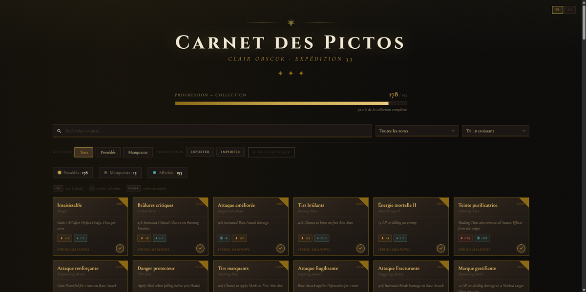
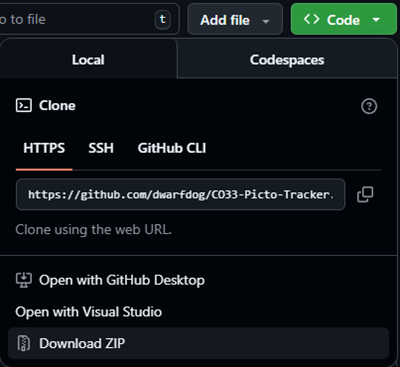
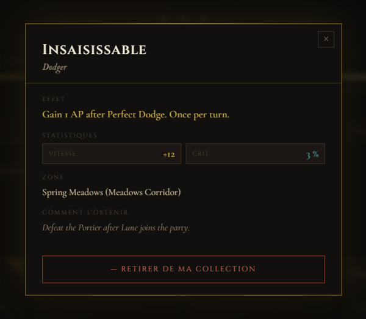

# Clair Obscur: Expedition 33 — Picto Tracker

> **[Francais](#-version-francaise)** | **[English](#-english-version)**

---

## 📌 23/02/2026 : 210 Pictos

---

##  Version Francaise

### Qu'est-ce que c'est ?

Un **carnet de collection** pour suivre les Pictos du jeu *Clair Obscur : Expedition 33*.

Cochez les Pictos que vous possedez, consultez leurs effets et statistiques, et suivez votre progression — le tout **sans compte, sans installation, directement dans votre navigateur**.

Vos donnees restent sur votre ordinateur (sauvegarde locale).



---

### Fonctionnalites

- Suivi de progression avec barre visuelle
- Fiche detaillee de chaque Picto (effet, stats, zone, obtention)
- Recherche par nom ou effet
- Filtres : par zone, possedes/manquants
- Tri : par numero, nom, zone, possession
- Export / import de votre progression (partage entre appareils)
- Interface en francais et anglais (detection automatique)
- Fonctionne hors-ligne, sans serveur

---

### Comment l'utiliser

#### 1. Telecharger

Cliquez sur le bouton vert **Code** en haut de cette page, puis **Download ZIP**.



#### 2. Extraire

Decompressez le fichier ZIP dans un dossier de votre choix.

#### 3. Ouvrir

Double-cliquez sur le fichier **`CO33-Pictos.html`** — il s'ouvre dans votre navigateur.

> Aucune installation necessaire. Fonctionne avec Chrome, Firefox, Edge, Safari.

---

### Comment ca marche

| Action | Resultat |
|--------|----------|
| **Clic sur une carte** | Ouvre la fiche detaillee |
| **Clic sur le rond** &#10003; **en bas a droite** | Coche / decoche le Picto |
| **Clic droit sur une carte** | Ouvre la fiche detaillee |
| **Touche Espace** (carte selectionnee) | Coche / decoche |
| **Touche Entree** (carte selectionnee) | Ouvre la fiche detaillee |



Votre progression est **sauvegardee automatiquement** dans votre navigateur. Elle persiste meme si vous fermez la page.

---

### Exporter / Importer votre progression

Vous changez d'ordinateur ou de navigateur ?

1. Cliquez sur **Exporter** — un code est copie dans votre presse-papier
2. Sur l'autre appareil, cliquez sur **Importer**, collez le code, puis **Appliquer**

Vous pouvez aussi utiliser un fichier `.json` pour transferer votre progression.

---

### Changer la langue

L'application detecte automatiquement la langue de votre navigateur. Vous pouvez aussi changer manuellement avec les boutons **FR** / **EN** en haut a droite.

---

### Ajouter une nouvelle langue

Vous voulez traduire l'application dans votre langue ? C'est simple :

1. **Copiez** le fichier `lang/en.js` et renommez-le (ex: `lang/es.js` pour l'espagnol)
2. **Traduisez** tous les textes entre guillemets dans le fichier
3. **Changez** les identifiants :
   - `App.langs.en` devient `App.langs.es`
   - `App.SUPPORTED_LANGS.push('en')` devient `App.SUPPORTED_LANGS.push('es')`
   - `lang_name` doit contenir le nom natif de la langue (ex: `'Espanol'`)
4. **Ajoutez** cette ligne dans le fichier `CO33-Pictos.html`, juste apres les autres langues :
   ```html
   <script src="lang/es.js"></script>
   ```
5. Le bouton de langue apparait automatiquement !

> Pour les donnees des Pictos (noms, effets), ajoutez les champs `nom_es`, `effet_es`, etc. dans le fichier `js/datas/skills-data.js`.

---

### Proposer une amelioration

Vous avez trouve une erreur de traduction, un bug, ou une idee ?

- **Signalez un probleme** : allez dans l'onglet [Issues](../../issues) et decrivez le probleme
- **Proposez une modification** : creez un [Pull Request](../../pulls)

Meme si vous n'etes pas developpeur, n'hesitez pas a ouvrir une Issue pour signaler une erreur dans les donnees d'un Picto (nom, effet, zone...).

---

### Structure du projet

```
CO33-Script/
  CO33-Pictos.html      <- Fichier a ouvrir dans le navigateur
  style.css              <- Apparence visuelle
  js/
    app.js               <- Configuration centrale
    boot.js              <- Demarrage de l'application
    cards.js             <- Affichage des cartes
    events.js            <- Interactions utilisateur
    export-import.js     <- Export / import de progression
    filters.js           <- Filtres et tri
    i18n.js              <- Systeme de traduction
    progress.js          <- Barre de progression
    state.js             <- Sauvegarde locale
    tooltip.js           <- Fiche detail (modal)
    ui-translate.js      <- Traduction de l'interface
    utils.js             <- Fonctions utilitaires
    datas/
      skills-data.js     <- Donnees des Pictos
  lang/
    fr.js                <- Traduction francaise
    en.js                <- Traduction anglaise
  docs/
    images/              <- Captures d'ecran du README
    data-maintenance.md   <- Processus de maintenance des donnees
  tools/
    check-all.js         <- Lance tous les controles locaux
    check-syntax.js      <- Verification de syntaxe JS
    validate-data.js     <- Validation des contraintes de donnees
    test-core.js         <- Tests coeur (sans navigateur)
    report-data.js       <- Rapport de couverture des donnees
```

---

### Verification rapide

Pour executer tous les controles locaux (syntaxe, coherence des donnees, tests coeur) :

```bash
node tools/check-all.js
```

Pour afficher un rapport de couverture des donnees :

```bash
node tools/report-data.js
```

---

### Credits

- **Jeu** : *Clair Obscur : Expedition 33* par [Sandfall Interactive](https://www.sandfallinteractive.com/)
- Les donnees des Pictos sont extraites du jeu a des fins de reference pour la communaute
- Ce projet n'est pas affilie a Sandfall Interactive

---
---

##  English Version

### What is this?

A **collection tracker** for the Pictos in *Clair Obscur: Expedition 33*.

Check off the Pictos you own, view their effects and stats, and track your progress — all **with no account, no install, straight in your browser**.

Your data stays on your computer (local storage).


---

### Features

- Visual progress bar
- Detailed info card for each Picto (effect, stats, zone, how to obtain)
- Search by name or effect
- Filters: by zone, owned/missing
- Sort: by number, name, zone, ownership
- Export / import your progress (share between devices)
- French and English interface (auto-detected)
- Works offline, no server needed

---

### How to use

#### 1. Download

Click the green **Code** button at the top of this page, then **Download ZIP**.


#### 2. Extract

Unzip the file to a folder of your choice.

#### 3. Open

Double-click **`CO33-Pictos.html`** — it opens in your browser.

> No installation needed. Works with Chrome, Firefox, Edge, Safari.

---

### Controls

| Action | Result |
|--------|--------|
| **Click a card** | Opens the detail panel |
| **Click the** &#10003; **circle (bottom right)** | Toggles ownership |
| **Right-click a card** | Opens the detail panel |
| **Space** (card focused) | Toggles ownership |
| **Enter** (card focused) | Opens the detail panel |


Your progress is **saved automatically** in your browser. It persists even after closing the page.

---

### Export / Import your progress

Switching computers or browsers?

1. Click **Export** — a code is copied to your clipboard
2. On the other device, click **Import**, paste the code, then **Apply**

You can also use a `.json` file to transfer your progress.

---

### Change language

The app automatically detects your browser language. You can also switch manually using the **FR** / **EN** buttons in the top right corner.

---

### Add a new language

Want to translate the app into your language? Here's how:

1. **Copy** `lang/en.js` and rename it (e.g., `lang/es.js` for Spanish)
2. **Translate** all the text strings in the file
3. **Update** the identifiers:
   - `App.langs.en` becomes `App.langs.es`
   - `App.SUPPORTED_LANGS.push('en')` becomes `App.SUPPORTED_LANGS.push('es')`
   - `lang_name` should contain the native language name (e.g., `'Espanol'`)
4. **Add** this line in `CO33-Pictos.html`, right after the other language scripts:
   ```html
   <script src="lang/es.js"></script>
   ```
5. The language button appears automatically!

> For Picto data (names, effects), add `nom_es`, `effet_es`, etc. fields in `js/datas/skills-data.js`.

---

### Contributing

Found a translation error, a bug, or have an idea?

- **Report an issue**: go to the [Issues](../../issues) tab and describe the problem
- **Suggest a change**: create a [Pull Request](../../pulls)

Even if you're not a developer, feel free to open an Issue to report incorrect Picto data (name, effect, zone...).

---

### Project structure

```
CO33-Script/
  CO33-Pictos.html      <- Open this file in your browser
  style.css              <- Visual styling
  js/
    app.js               <- Central configuration
    boot.js              <- Application startup
    cards.js             <- Card display
    events.js            <- User interactions
    export-import.js     <- Progress export / import
    filters.js           <- Filters and sorting
    i18n.js              <- Translation system
    progress.js          <- Progress bar
    state.js             <- Local storage
    tooltip.js           <- Detail panel (modal)
    ui-translate.js      <- Interface translation
    utils.js             <- Utility functions
    datas/
      skills-data.js     <- Data for all Pictos
  lang/
    fr.js                <- French translation
    en.js                <- English translation
  docs/
    images/              <- README screenshots
    data-maintenance.md   <- Data maintenance workflow
  tools/
    check-all.js         <- Runs all local checks
    check-syntax.js      <- JS syntax validation
    validate-data.js     <- Data constraint validation
    test-core.js         <- Core tests (no browser required)
    report-data.js       <- Data coverage report
```

---

### Quick validation

Run all local checks (syntax, data consistency, core tests):

```bash
node tools/check-all.js
```

To print a data coverage report:

```bash
node tools/report-data.js
```

---

### Credits

- **Game**: *Clair Obscur: Expedition 33* by [Sandfall Interactive](https://www.sandfallinteractive.com/)
- Picto data is extracted from the game for community reference purposes
- This project is not affiliated with Sandfall Interactive

---

<p align="center">
  <i>Made with care for the Expedition 33 community</i>
</p>
